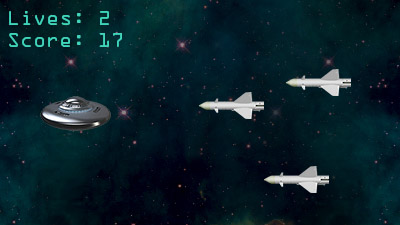

# Shmup
---

For our second MonoGame project, we'll make a side-scrolling shoot-em-up. We'll build this up over a couple of weeks.

- We will set the window size to be 1280 × 720 or 1920 × 1080
- We'll create a class hierarchy to implement the objects in our game
- We'll give our sprite class collision detection
- We'll create a player sprite with movement
- We'll manage a list of randomly spawning obstacles
- We'll create a simple text-based UI showing a score and lives
---
- OPTIONAL CHALLENGE: Add shooting
	In the class version, we will skip this step. (The asteroids task will cover shooting mechanics.) If you want to try to figure it out, feel free!